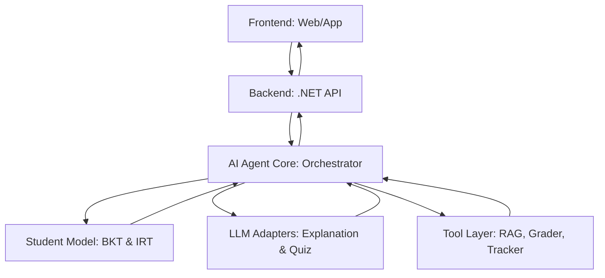

# PHẦN 1: KẾ HOẠCH CHI TIẾT TỔNG QUAN HỆ THỐNG AI AGENT GIA SƯ CÁ NHÂN HÓA

## 1. Đặt vấn đề (Problem Statement)
Trong giáo dục truyền thống và các hệ thống E-learning hiện nay, lộ trình học tập thường được thiết kế cố định cho mọi học sinh (**One-size-fits-all**). Điều này dẫn đến hai vấn đề chính:
*   **Thiếu cá nhân hóa:** Không nhận diện được lỗ hổng kiến thức cụ thể của từng học sinh.
*   **Tốc độ không phù hợp:** Học sinh giỏi cảm thấy nhàm chán vì bài quá dễ, trong khi học sinh yếu cảm thấy áp lực vì bài quá khó.

**Mục tiêu đề tài:** Xây dựng một AI Agent đóng vai trò gia sư cá nhân, có khả năng tự động phân tích trình độ, lập kế hoạch giảng dạy, sinh nội dung thích ứng và điều chỉnh lộ trình học tập theo thời gian thực dựa trên phản hồi của học sinh.

---

## 2. Kiến trúc tổng thể hệ thống (System Architecture)

Hệ thống được xây dựng theo mô hình **Modular AI Agent**, tách biệt giữa bộ não điều khiển (Orchestrator), mô hình theo dõi người học (Student Model) và các công cụ thực thi (Tool Layer).

### 2.1. Sơ đồ luồng dữ liệu (High-level Flow)

### 2.2. Các thành phần cốt lõi
*   **AI Agent Core (Orchestrator):** Đóng vai trò "não bộ", tiếp nhận trạng thái học sinh, ra quyết định hành động (Dạy mới $\rightarrow$ Luyện tập $\rightarrow$ Kiểm tra) và điều phối các adapter.
*   **Student Model (BKT & IRT):** 
    *   **BKT (Bayesian Knowledge Tracing):** Theo dõi xác suất nắm vững từng kỹ năng (Skill Mastery).
    *   **IRT (Item Response Theory):** Định lượng năng lực học sinh ($\theta$) và độ khó câu hỏi ($\beta$).
*   **LLM Adapters (Fine-tuned Models):**
    *   **Explanation Adapter:** Chuyên trách việc giải thích kiến thức theo phương pháp sư phạm.
    *   **Quiz Adapter:** Chuyên trách việc sinh câu hỏi trắc nghiệm đúng định dạng JSON và đúng độ khó.
*   **Tool Layer:**
    *   **RAG (Retrieval Augmented Generation):** Cung cấp kiến thức chuẩn từ tài liệu giáo khoa để tránh ảo giác (Hallucination).
    *   **Grader:** Chấm điểm tự động và phân tích lỗi sai.
    *   **Progress Tracker:** Lưu trữ lịch sử học tập và trạng thái kỹ năng.
*   **Memory System:**
    *   **Short-term:** Lưu context hội thoại hiện tại.
    *   **Long-term:** Lưu trữ hồ sơ học tập, lỗi sai thường gặp trong Vector Database.

---

## 3. Vòng lặp vận hành của Agent (The Agent Loop)

Đây là cơ chế cốt lõi tạo nên tính "thích ứng" (Adaptive Learning) của hệ thống:

1.  **Nhận diện trạng thái:** Agent đọc trạng thái $P(L)$ từ BKT và năng lực $\theta$ từ IRT của học sinh.
2.  **Phân tích & Lập kế hoạch (Planning):** 
    *   Nếu $P(L) < \text{Threshold}_{low} \rightarrow$ Quyết định: **Giảng bài**.
    *   Nếu $\text{Threshold}_{low} \le P(L) < \text{Threshold}_{high} \rightarrow$ Quyết định: **Luyện tập**.
    *   Nếu $P(L) \ge \text{Threshold}_{high} \rightarrow$ Quyết định: **Chuyển bài mới**.
3.  **Sinh nội dung (Generation):** 
    *   Gọi **Explanation Adapter** (kèm RAG) để tạo bài giảng.
    *   Hoặc gọi **Quiz Adapter** (với độ khó $\beta \approx \theta$) để tạo bài tập.
4.  **Tương tác & Thu thập:** Học sinh tiếp nhận nội dung và trả lời câu hỏi.
5.  **Đánh giá & Cập nhật (Update):** 
    *   **Grader** chấm điểm $\rightarrow$ Cập nhật xác suất $P(L)$ trong BKT $\rightarrow$ Cập nhật năng lực $\theta$ trong IRT.
6.  **Lặp lại:** Quay lại bước 1 với trạng thái mới.

---

## 4. Lộ trình triển khai (Implementation Roadmap)

| Giai đoạn | Tên giai đoạn | Mục tiêu chính | Kết quả bàn giao (Deliverables) |
| :--- | :--- | :--- | :--- |
| **GĐ 1** | **Dataset Engineering** | Xây dựng tập dữ liệu cho 2 Adapter | Dataset (JSONL) cho Explanation & Quiz |
| **GĐ 2** | **Model Fine-tuning** | Huấn luyện 2 Adapter bằng QLoRA | 2 Adapter weights (.bin/.safetensors) |
| **GĐ 3** | **Student Model Dev** | Triển khai thuật toán BKT và IRT | Module tính toán $P(L)$ và $\theta$ |
| **GĐ 4** | **Agent Orchestration** | Xây dựng luồng điều phối bằng .NET | Hệ thống Agent Loop hoàn chỉnh |
| **GĐ 5** | **Integration & Eval** | Kết nối Frontend, Backend và Đánh giá | Báo cáo đánh giá (JSON rate, MAE, Win-rate) |

---

## 5. Tiêu chí thành công (Success Metrics)

Hệ thống được coi là thành công khi đạt được các chỉ số sau:
*   **Về kỹ thuật:** 
    *   Tỷ lệ sinh JSON hợp lệ của Quiz Adapter $> 95\%$.
    *   Độ lệch độ khó (MAE) của câu hỏi sinh ra so với thực tế thấp.
    *   Win-rate của Explanation Adapter cao hơn Base Model khi được chấm bởi GPT-4o.
*   **Về giáo dục:** 
    *   Học sinh có sự tăng trưởng về $P(L)$ (xác suất nắm vững kiến thức) qua thời gian.
    *   Lộ trình học tập thay đổi linh hoạt theo năng lực thực tế của người dùng.
