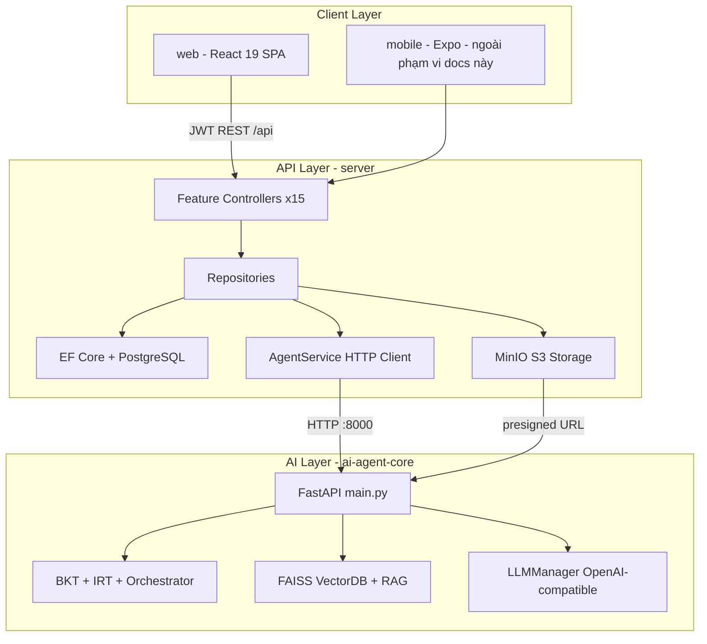

# Kiến trúc hệ thống EduBoost

## Tổng quan 3 tầng

## Deployment

| Service | Port | Docker |
|---------|------|--------|
| web (Vite dev) | 5173 | — |
| server | 5000 | `server/Dockerfile` |
| ai-agent-core | 8000 | `ai-agent-core/Dockerfile` |
| PostgreSQL | 5432 | docker-compose |
| MinIO | 9000 | docker-compose |

**Dev proxy:** Vite proxy `/api` → `http://localhost:5000` ([web/vite.config.ts](../../web/vite.config.ts)).

**Agent URL:** `AIAgent:BaseUrl` trong `appsettings.json` (mặc định `http://host.docker.internal:8000`).

## Luồng dữ liệu chính

### 1. Upload tài liệu → RAG
Teacher/Student upload → MinIO presigned PUT → confirm → background `AgentService.IngestDocumentAsync` → FAISS index.

### 2. Sinh quiz từ tài liệu
`POST generate-quiz` → `AgentService.GenerateQuizBatchAsync` → validate MCQ → lưu Quiz (type `pool` hoặc append).

### 3. Adaptive tutoring
Student practice → `GET tutor/next-action` → agent BKT decision → generate question / explain → submit → fire-and-forget `update-state`.

### 4. Học tập thích ứng
Entry test → Roadmap → Practice (tutor) → BKT persist (PostgreSQL) → Review schedule (spaced repetition) → Practice session.

## Phân tách trách nhiệm

| Concern | Tầng xử lý | Ghi chú |
|---------|------------|---------|
| Auth JWT + refresh rotation | server | BCrypt, RefreshToken DB |
| File storage | server + MinIO | 2 buckets: class / student |
| Business rules / enrollment | server repositories | ⚠️ RBAC yếu |
| BKT persistence (long-term) | server PostgreSQL | `BktState`, `SpacedRepetitionItem` |
| BKT session (short-term tutor) | ai-agent in-memory | ⚠️ Mất khi restart |
| Quiz generation / grading LLM | ai-agent-core | Sequential per-question |
| Vector search ACL | ai-agent `allowed_document_ids` | Filter tại search time |

## Liên kết

- [tech-stack.md](tech-stack.md)
- [glossary.md](glossary.md)
- [../04-integration/web-server-agent-map.md](../04-integration/web-server-agent-map.md)
- [../99-known-issues/index.md](../99-known-issues/index.md)
