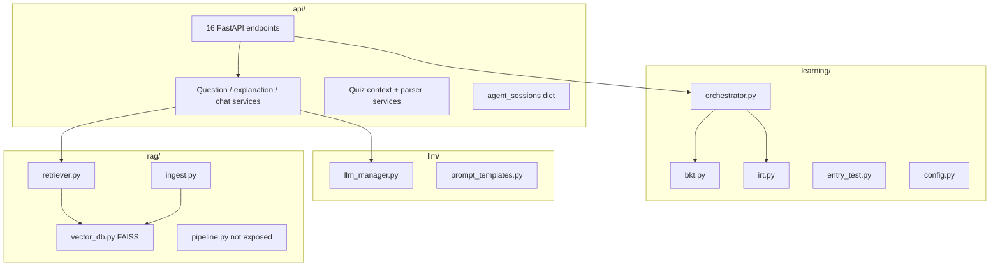

# AI Agent Architecture

`routes/tutor.py` chỉ chuyển đổi HTTP input/output. Logic RAG, prompt, retry và
chuẩn hóa kết quả nằm trong `api/services/`; `quiz_batch_service.py` tiếp tục là
façade tương thích cho các module cũ.

Phần đánh giá nằm ngoài runtime tại `tools/evaluation/`; phép đo JSON thuần ở
`quiz_scoring.py` tách khỏi luồng gọi
LLM-as-a-judge, nên unit test không cần model hoặc API bên ngoài.

## Startup (lifespan)

1. Bootstrap `resources/faiss-seed` vào volume `var/faiss` nếu volume trống
2. Load FAISS index (`FAISS_INDEX_PATH`)
3. Init `VectorDB`, `KnowledgeRetriever`, `RAGIngestor`
4. Auto-ingest `data/raw/` nếu index empty
5. Init `LLMManager` quiz + explain roles
6. Graceful degradation nếu RAG/LLM fail

## In-memory state ⚠️

| Dict | Key | Mất khi |
|------|-----|---------|
| `agent_sessions` | student_id | Restart / scale |
| `entry_test_sessions` | session_id | Restart |

## Dual RAG paths

| Path | Used by | Reranker |
|------|---------|----------|
| API | `/rag/*`, tutor endpoints | No |
| RAGPipeline | CLI `test_pipeline.py` | Yes |

## Liên kết

- [api/endpoints.md](api/endpoints.md)
- [../04-integration/web-server-agent-map.md](../04-integration/web-server-agent-map.md)
