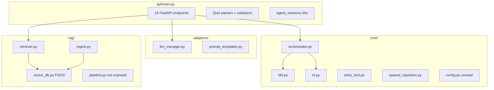

# AI Agent Architecture

## Startup (lifespan)

1. Load FAISS index (`FAISS_INDEX_PATH`)
2. Init `VectorDB`, `KnowledgeRetriever`, `RAGIngestor`
3. Auto-ingest `data/raw/` nếu index empty
4. Init `LLMManager` quiz + explain roles
5. Graceful degradation nếu RAG/LLM fail

## In-memory state ⚠️

| Dict | Key | Mất khi |
|------|-----|---------|
| `agent_sessions` | student_id | Restart / scale |
| `entry_test_sessions` | session_id | Restart |

## Dual RAG paths

| Path | Used by | Reranker |
|------|---------|----------|
| API | `/rag/*`, tutor endpoints | No |
| RAGPipeline | CLI `test_pipeline.py` | Yes |

## Liên kết

- [api/endpoints.md](api/endpoints.md)
- [../04-integration/web-server-agent-map.md](../04-integration/web-server-agent-map.md)
