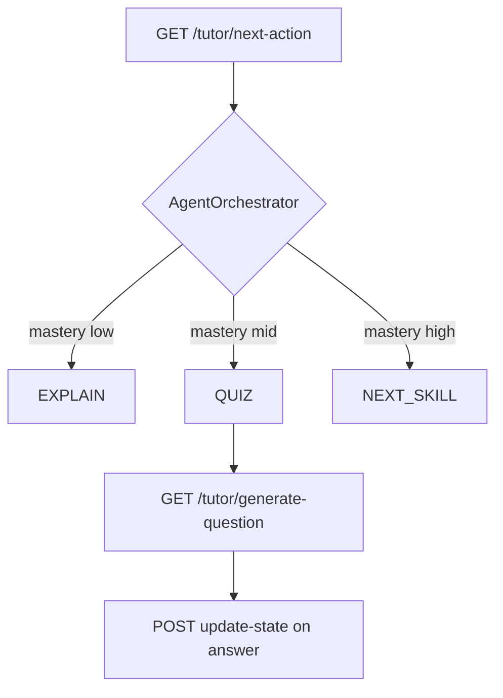

# AI Agent Flows

| Flow | Doc |
|------|-----|
| RAG ingest | [../../04-integration/flows/02-document-upload-rag.md](../../04-integration/flows/02-document-upload-rag.md) |
| Batch quiz | [../../04-integration/flows/03-generate-quiz-from-document.md](../../04-integration/flows/03-generate-quiz-from-document.md) |
| Tutor practice | [../../04-integration/flows/10-ai-tutor-practice.md](../../04-integration/flows/10-ai-tutor-practice.md) |
| AI chat | [../../04-integration/flows/13-ai-chat-rag.md](../../04-integration/flows/13-ai-chat-rag.md) |

## Tutor decision flow

## Batch quiz flow

`POST /tutor/generate-quiz` → load context (RAG or doc_url) → for each difficulty slot → `QUIZ_TEMPLATE` per question sequential → parse + dedup retries → return `{ questions: [...] }`.

⚠️ `MAX_CONCURRENT = 1`, có thể trả ít câu hơn yêu cầu.
