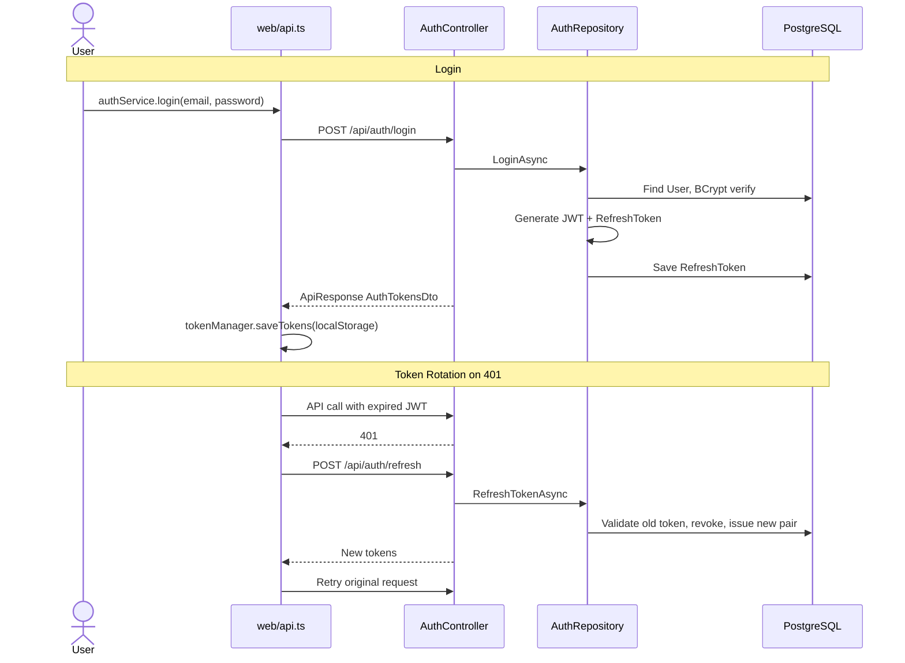

# Luồng: Auth + Token Rotation

> Trạng thái: ✅ (core); ⚠️ admin redirect

## Trigger

User submit login/register form hoặc app init với token trong localStorage.

## Sequence diagram

## Bảng bước

| Step | Layer | File:Function | API | Ghi chú |
|------|-------|---------------|-----|---------|
| 1 | web | `login-page.tsx` submit | — | Form validation |
| 2 | web | `authService.login` | `POST /api/auth/login` | Save tokens |
| 3 | server | `AuthRepository.LoginAsync` | — | BCrypt + JWT 60m |
| 4 | web | `authStore.setAuth` | — | Navigate by role |
| 5 | web | `api.ts` interceptor | `POST /api/auth/refresh` | Queue on 401 |
| 6 | web | `authStore.initialize` | `GET /api/auth/me` | App boot |

## Hàm chính

| Hàm | File | Trạng thái |
|-----|------|------------|
| `login` | `auth.service.ts` | ✅ |
| `register` | `auth.service.ts` | ⚠️ role từ client |
| `initialize` | `auth-store.ts` | ✅ |
| `LoginAsync` | `AuthRepository.cs` | ✅ |
| `RefreshTokenAsync` | `AuthRepository.cs` | ✅ token rotation |

## Error paths

- Refresh fail → `setOnLogoutCallback` → clear tokens → redirect login
- Auth endpoints excluded from retry loop (tránh infinite loop)

## Trạng thái & hạn chế

- Login redirect: teacher → `/teacher/classes`, others → `/student/dashboard` — admin phải navigate thủ công ⚠️
- Register cho phép chọn role — server không validate ❌

## Liên kết

- [../web-server-agent-map.md](../web-server-agent-map.md)
- [../../01-web/services/auth.service.md](../../01-web/services/auth.service.md)
- [../../02-server/features/auth.md](../../02-server/features/auth.md)
