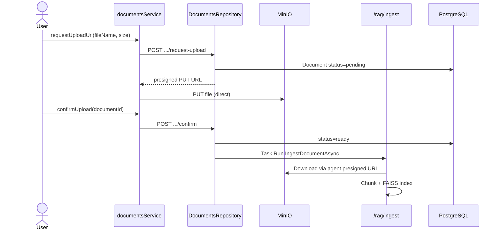

# Luồng: Upload tài liệu + RAG Ingest

> Trạng thái: ⚠️

## Trigger

Teacher upload trong Documents tab hoặc Student upload trong AI Lab.

## Sequence diagram

## Bảng bước

| Step | Layer | File | API | Ghi chú |
|------|-------|------|-----|---------|
| 1 | web | `documentsService.request*UploadUrl` | `POST .../request-upload` | ✅ |
| 2 | web | `uploadFileToMinio` | MinIO PUT | ✅ |
| 3 | web | `confirm*Upload` | `POST .../confirm` | ✅ |
| 4 | server | `DocumentsRepository` | — | Background ingest |
| 5 | server | `AgentService.IngestDocumentAsync` | `POST /rag/ingest` | ⚠️ async |
| 6 | agent | `ingest_document` | — | Semantic chunk + FAISS |

## Scopes

| Scope | Bucket | Path prefix |
|-------|--------|-------------|
| class | `eduboost-class-docs` | Teacher class docs |
| student | `eduboost-student-docs` | AI Lab private |

## Trạng thái & hạn chế

- Ingest chạy `Task.Run` — không track completion ⚠️
- Ingest fail → document vẫn `ready` ❌
- Delete doc → background `/rag/delete` — same issue

## Liên kết

- [../../02-server/infrastructure/minio-storage.md](../../02-server/infrastructure/minio-storage.md)
- [../../03-ai-agent-core/rag/ingest.md](../../03-ai-agent-core/rag/ingest.md)
