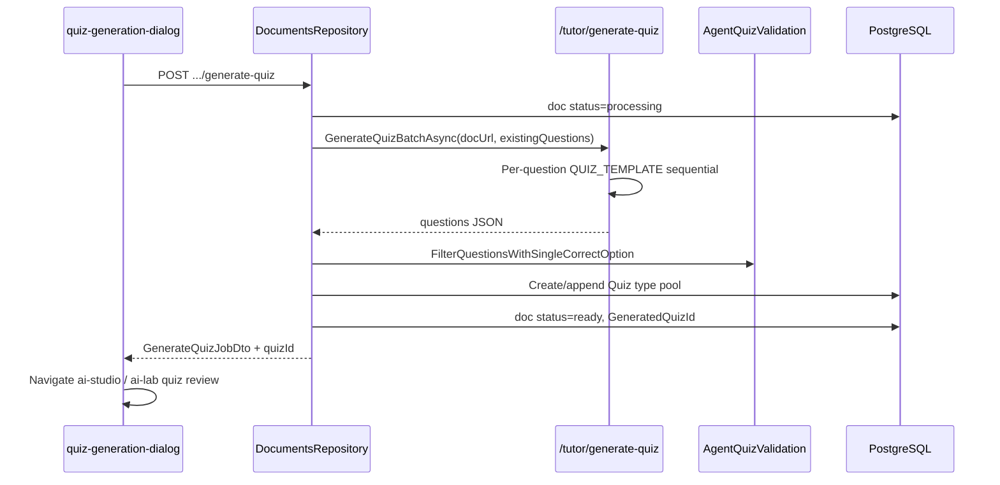

# Luồng: Generate Quiz từ Document

> Trạng thái: ✅

## Trigger

`QuizGenerationDialog` sau khi document `ready` — teacher (class doc) hoặc student (AI Lab).

## Sequence diagram

## Modes

| Mode | Behavior |
|------|----------|
| `create` | Quiz mới |
| `append` | Thêm vào pool quiz hiện có |
| advanced | Split easy/medium/hard counts |

## Hàm chính

| Hàm | Layer | Trạng thái |
|-----|-------|------------|
| `generateQuizFromDocument` | web | ✅ |
| `GenerateQuizFromDocumentAsync` | server | ✅ |
| `GenerateQuizBatchAsync` | AgentService | ✅ 600s timeout |
| `generate_quiz_batch` | agent | ⚠️ sequential, partial batch |

## Trạng thái & hạn chế

- Blocking synchronous call — UI chờ đến 10 phút có thể
- Agent có thể trả ít câu hơn requested ⚠️
- Dedup against `existing_questions` từ pool hiện có ✅

## Liên kết

- [../../03-ai-agent-core/api/quiz-parsers.md](../../03-ai-agent-core/api/quiz-parsers.md)
- [06-ai-studio-publish.md](06-ai-studio-publish.md)
