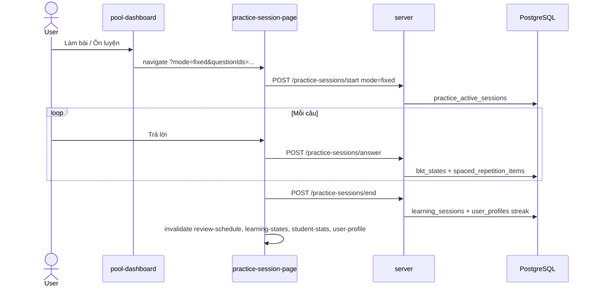

# Luồng: Quiz Pool Student Revision

> Trạng thái: ✅

## Trigger

Student pool dashboard — tab **Kho Pool cá nhân** hoặc **Bộ ôn tập của tôi**, nút **Làm bài** / **Ôn luyện**

## Sequence diagram

## Bảng bước

| Step | Layer | File / Module | API / Endpoint | Ghi chú |
|------|-------|---------------|----------------|---------|
| 1 | web | `pool-dashboard.tsx` | — | Redirect sang practice-session (không còn overlay client-only) |
| 2 | web | `practiceSession.service.ts` | POST `/practice-sessions/start` mode=`fixed` | `startFixed(questionIds, topicId?)` |
| 3 | server | `PracticeSessionsRepository` | answer + end | BKT/SR per answer; streak on end |
| 4 | server | `PoolRepository` | create-revision-set | Copy câu hỏi kèm `SourceTopicId` |
| 5 | web | React Query invalidate | — | Ôn tập, Tổng quan, Hồ sơ refresh sau end |

## Revision set multi-topic

- Câu hỏi trong bộ ôn tập private có `SourceTopicId` (topic pool gốc).
- Mỗi answer resolve topic từ `SourceTopicId ?? Quiz.TopicId`.
- Roadmap sync cho mọi topic có `ClassId` trong phiên.

## Error paths & fallback

- **401:** Axios refresh queue → retry hoặc logout
- **403 fixed start:** Học sinh không sở hữu revision set / không có quyền topic
- **Missing questionIds:** Redirect bị chặn; toast lỗi trên pool dashboard

## Liên kết

- [12-practice-session.md](12-practice-session.md)
- [11-bkt-review-schedule.md](11-bkt-review-schedule.md)
- [web-server-agent-map.md](../web-server-agent-map.md)
