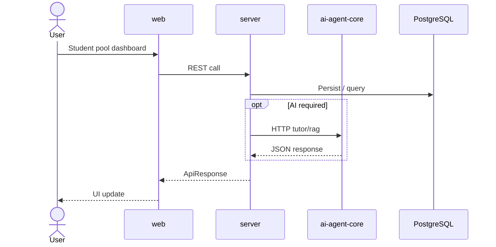

# Luồng: Quiz Pool Student Revision

> Trạng thái: ⚠️

## Trigger

Student pool dashboard

## Sequence diagram

## Bảng bước

| Step | Layer | File / Module | API / Endpoint | Ghi chú |
|------|-------|---------------|----------------|---------|
| 1 | web | See integration map | — | User action |
| 2 | web | Service layer | REST | JWT attached |
| 3 | server | PoolRepository.cs | POST create-revision-set, GET revision-sets | Repository logic |
| 4 | server | AgentService (if any) | Agent HTTP | Graceful degradation |
| 5 | web | React Query invalidate | — | UI refresh |

## Error paths & fallback

- **401:** Axios refresh queue → retry hoặc logout
- **Agent offline:** Tutor/chat trả placeholder; quiz generation fail message
- **Upload fail:** Toast error, document status `pending` không confirm

## Trạng thái & hạn chế

revision-sets gọi inline apiClient

## Liên kết

- [web-server-agent-map.md](../web-server-agent-map.md)
- [../../99-known-issues/index.md](../../99-known-issues/index.md)
