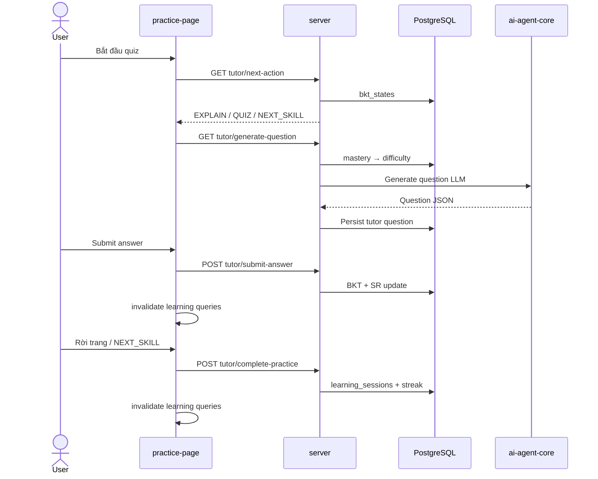

# Luồng: AI Tutor Practice

> Trạng thái: ✅

## Trigger

Practice page (`/student/practice/:topicId`), roadmap, learning path

## Sequence diagram

## BKT routing (server)

[`TutorDecisionService.cs`](../../../server/Infrastructure/Services/TutorDecisionService.cs) — ngưỡng giống agent orchestrator:

| Mastery P(L) | Action |
|--------------|--------|
| &lt; 0.5 | EXPLAIN |
| 0.5 – 0.8 | QUIZ |
| ≥ 0.8 | NEXT_SKILL |

Độ khó sinh câu hỏi: `MapMasteryToDifficulty` từ BKT (hoặc `IrtTheta` nếu có).

## Trạng thái

- PostgreSQL là nguồn sự thật duy nhất cho BKT/SR và tutor routing
- Sau mỗi câu trả lời: web invalidate `review-schedule`, `learning-states`, `student-stats`, `user-profile`, `roadmap`
- Khi kết thúc phiên: `POST /quizzes/tutor/complete-practice` ghi `learning_sessions` + streak (giống practice-session end)
- Agent **không** còn fire-and-forget `update-state` từ submit
- Agent endpoints `/tutor/next-action`, `/tutor/update-state` vẫn tồn tại nhưng .NET **không gọi** cho luồng sản phẩm

## Liên kết

- [learningstates.md](../../02-server/features/learningstates.md)
