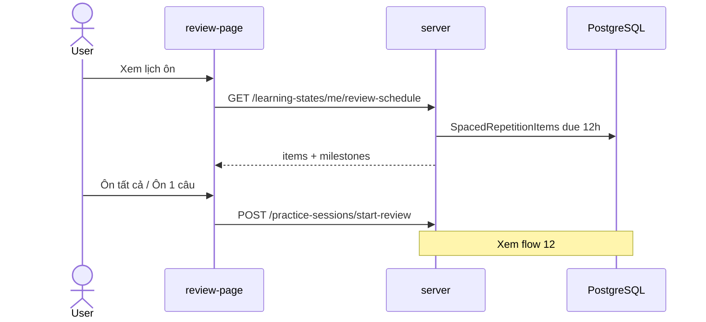

# Luồng: BKT + Review Schedule

> Trạng thái: ✅

## Trigger

Dashboard, review page (`/student/review`)

## Sequence diagram

## Bảng bước

| Step | Layer | File / Module | API / Endpoint | Ghi chú |
|------|-------|---------------|----------------|---------|
| 1 | web | `review-page.tsx` | — | Hiển thị due items, mốc SM-2 |
| 2 | web | `learningState.service.ts` | GET review-schedule | React Query |
| 3 | server | `LearningStatesRepository` | `/api/learning-states/*` | SM-2 via `SpacedRepetitionService` |
| 4 | web | `practice-session-page` | POST start-review | `mode=review` query param |
| 5 | web | React Query invalidate | — | Sau kết thúc session |

## SM-2 milestones (UI)

| RepetitionCount | Interval tiếp theo | Label |
|-----------------|---------------------|-------|
| 1 | 1 ngày | Mốc 1 |
| 2 | 6 ngày | Mốc 2 |
| 3+ | interval × ease | Mốc 3+ |

## Trạng thái

- Agent SM-2 endpoint không dùng — server PostgreSQL là nguồn sự thật
- Mọi luồng trả lời (practice, quiz, placement, tutor) ghi `bkt_states` + `spaced_repetition_items`

## Liên kết

- [12-practice-session.md](12-practice-session.md)
- [learningstates.md](../../02-server/features/learningstates.md)
