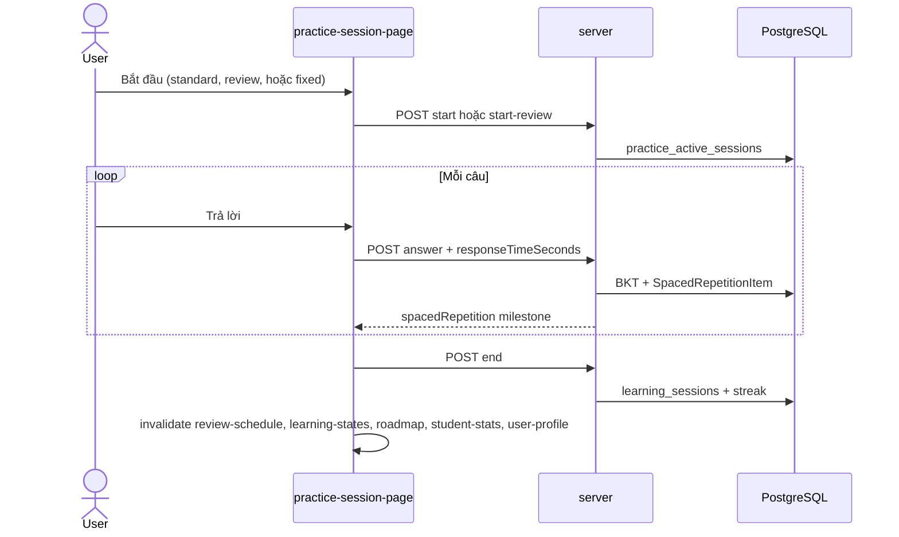

# Luồng: Practice Session

> Trạng thái: ✅

## Trigger

Review page, dashboard ("Ôn ngay"), `/student/practice-session`, **Quiz Pool** (mode `fixed`)

## Sequence diagram

## Modes

| Mode | API | Chọn câu | Feedback khi trả lời |
|------|-----|----------|----------------------|
| `standard` | POST `/start` | Random theo BKT difficulty | Inline: đúng/sai + giải thích + LLM |
| `review` | POST `/start-review` | Đúng questionIds due | Inline |
| `fixed` | POST `/start` mode=`fixed` | Đúng questionIds (Quiz Pool) | Inline |
| `practice` + `quizId` | POST `/start` | Câu quiz lớp đã publish | Inline (giống pool cá nhân) |
| `test` + `quizId` | POST `/start` | Câu quiz lớp đã publish | Ẩn — xem lại sau `end` qua `reviewItems` |

## Bảng bước

| Step | Layer | File | Ghi chú |
|------|-------|------|---------|
| 1 | web | `practiceSession.service.ts` | `start`, `startReview`, `startFixed`, `endSession` |
| 2 | server | `PracticeSessionsRepository` | DB-persisted sessions (TTL 2h) |
| 3 | server | `LearningStatesRepository` | Mỗi answer → BKT + SR (topic per question) |

## Trạng thái

- Sessions lưu `practice_active_sessions` (không còn purely in-memory)
- Review mode truyền đúng câu due từ schedule
- Fixed mode: `topicId` optional (revision set resolve từ `SourceTopicId`)
- Sau `endSession`: invalidate đủ cache cho Ôn tập, Tổng quan, Hồ sơ

## Liên kết

- [11-bkt-review-schedule.md](11-bkt-review-schedule.md)
- [05-quiz-pool-student.md](05-quiz-pool-student.md)
- [practicesessions.md](../../02-server/features/practicesessions.md)
