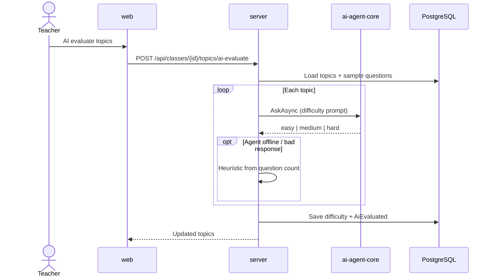

# Luồng: Topic AI Evaluate

> Trạng thái: ✅

## Trigger

Teacher bấm "AI đánh giá độ khó" trên tab Topics trong class detail.

## Sequence diagram

## Bảng bước

| Step | Layer | File / Module | API / Endpoint | Ghi chú |
|------|-------|---------------|----------------|---------|
| 1 | web | `topics.service.ts` | POST `topics/ai-evaluate` | Teacher only |
| 2 | server | `TopicsController.AiEvaluate` | RBAC teacher owns class | |
| 3 | server | `TopicsRepository.AiEvaluateAsync` | `AgentService.AskAsync` | Fallback heuristic |
| 4 | server | `TopicDifficultyParser` | — | Parse AI + heuristic bands |

## Error paths & fallback

- **Agent offline:** Heuristic theo số câu hỏi (≥10 hard, ≥6 medium, else easy)
- **Unparseable AI text:** Cùng heuristic
- **401/403:** JWT / teacher ownership

## Liên kết

- [web-server-agent-map.md](../web-server-agent-map.md)
- [../../99-known-issues/server-gaps.md](../../99-known-issues/server-gaps.md)
