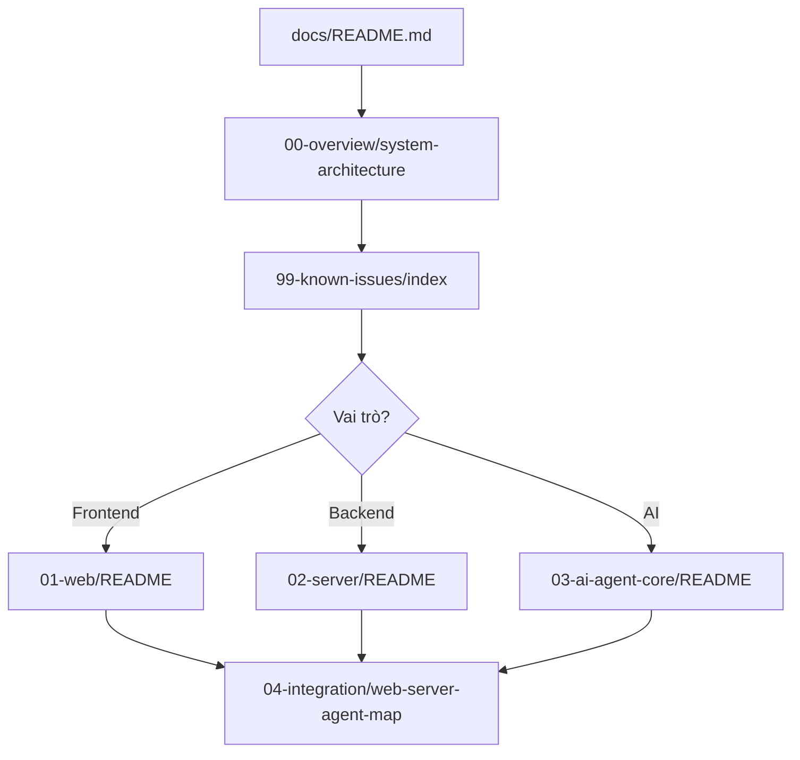

# EduBoost — Tài liệu hệ thống A–Z

Tài liệu tham chiếu đầy đủ cho toàn bộ hệ thống EduBoost: **web** (React), **server** (.NET 9), **ai-agent-core** (FastAPI/Python).

## Huy hiệu trạng thái

| Badge | Ý nghĩa |
|-------|---------|
| ✅ Hoàn thiện | Code + UI + API khớp, đã verify |
| ⚠️ Chưa tối ưu | Chạy được nhưng có nợ kỹ thuật |
| 🔧 Chưa hoàn thiện | Stub, UI chưa nối, endpoint orphan |
| ❌ Chưa đúng / lỗi | Lỗ hổng bảo mật, hành vi sai spec |

## Bản đồ đọc theo vai trò

### Dev Frontend
1. [01-web/README.md](01-web/README.md) — Kiến trúc React
2. [01-web/routing.md](01-web/routing.md) — Toàn bộ routes
3. [01-web/services/](01-web/services/) — 16 API service modules
4. [01-web/features/](01-web/features/) — Từng trang/tính năng UI
5. [04-integration/web-server-agent-map.md](04-integration/web-server-agent-map.md) — UI → API mapping

### Dev Backend
1. [02-server/README.md](02-server/README.md) — Vertical slice architecture
2. [02-server/features/](02-server/features/) — 15 feature slices
3. [02-server/infrastructure/](02-server/infrastructure/) — DB, MinIO, AgentService
4. [04-integration/api-reference.md](04-integration/api-reference.md) — ~85 REST endpoints

### Dev AI / ML
1. [03-ai-agent-core/README.md](03-ai-agent-core/README.md)
2. [03-ai-agent-core/api/](03-ai-agent-core/api/) — 16 FastAPI endpoints
3. [03-ai-agent-core/core/](03-ai-agent-core/core/) — BKT, IRT, orchestrator
4. [ai-agent-core/docs/](../ai-agent-core/docs/) — Training, RAG theory (tiếng Việt)

### QA / PM
1. [99-known-issues/index.md](99-known-issues/index.md) — **Đọc trước khi test**
2. [04-integration/flows/](04-integration/flows/) — 18 luồng end-to-end
3. [04-integration/data-models.md](04-integration/data-models.md) — Entities & DTOs

## Cấu trúc thư mục

```
docs/
├── README.md                    ← Bạn đang ở đây
├── 00-overview/                 Tổng quan kiến trúc, tech stack, glossary
├── 01-web/                      Frontend React 19
├── 02-server/                   Backend ASP.NET Core 9
├── 03-ai-agent-core/            AI Agent FastAPI
├── 04-integration/              API reference, data models, flows, mapping
└── 99-known-issues/             Gap, technical debt, inconsistencies
```

## Tài liệu cũ (deprecated)

| File cũ | Thay thế bởi |
|---------|--------------|
| `web-technical-spec.md` | [01-web/architecture.md](01-web/architecture.md) |
| `implementation-plan.md` | [99-known-issues/index.md](99-known-issues/index.md) |
| `code-flows.md` | [04-integration/flows/](04-integration/flows/) |
| `api-reference.md` (root) | [04-integration/api-reference.md](04-integration/api-reference.md) |
| `data-models.md` (root) | [04-integration/data-models.md](04-integration/data-models.md) |
| `features.md` (root) | [01-web/features/](01-web/features/) |

## Luồng đọc nhanh (người mới)



## Thống kê hệ thống

| Tầng | Công nghệ | File nguồn | API/Endpoints |
|------|-----------|------------|---------------|
| web | React 19, Vite 8, TanStack Query, Zustand | ~72 TS/TSX | 16 service modules |
| server | ASP.NET Core 9, EF Core, PostgreSQL | ~70 C# | ~85 REST endpoints |
| ai-agent-core | FastAPI, FAISS, sentence-transformers | ~18 Python | 16 HTTP endpoints |
