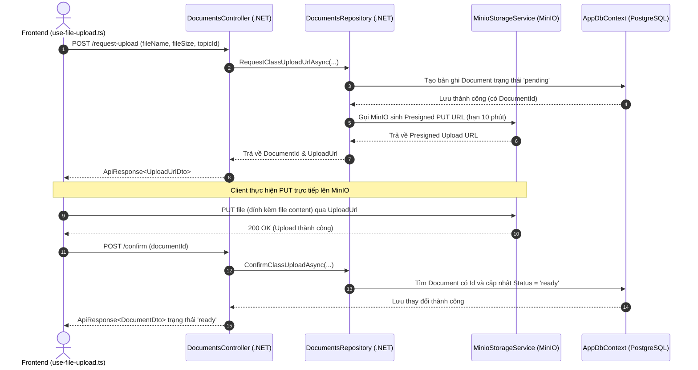

> **DEPRECATED** — Đã mở rộng thành 18 luồng tại [04-integration/flows/](04-integration/flows/README.md).

# EduBoost — Đặc Tả Luồng Xử Lý Mã Nguồn (Code Flows Specification)

Tài liệu này ánh xạ chi tiết các luồng xử lý cốt lõi của hệ thống EduBoost từ giao diện người dùng (React Web & React Native Mobile) qua tầng Web API .NET Core 9 cho đến nhân AI Agent Core (FastAPI & Python). Việc đặc tả chi tiết này giúp nhà phát triển dễ dàng đối chiếu từ tài liệu sang mã nguồn thực tế để thực hiện chỉnh sửa chính xác khi có thay đổi nghiệp vụ.

---

## 1. Tổng Quan Bản Đồ Source Code & Cấu Trúc File Cốt Lõi

```
eduboost/
├── server/                                ← Tầng Web API (.NET Core 9)
│   ├── Program.cs                         ← Cài đặt DI, Middleware, Routing, CORS và Auto-Migration
│   ├── Features/                          ← Kiến trúc Vertical Slice (mỗi Feature chứa Controller, DTOs, Repository)
│   │   ├── Auth/                          ← Xử lý đăng ký, đăng nhập và Token Rotation
│   │   ├── Documents/                     ← Quản lý tài liệu và kết nối MinIO Storage
│   │   ├── Quizzes/                       ← Điều phối bài kiểm tra, chấm điểm và AI Tutor endpoints
│   │   └── Roadmap/                       ← Tạo lộ trình học thích ứng
│   └── Infrastructure/
│       ├── AppDbContext.cs                ← Cấu hình EF Core, mapping Entities với PostgreSQL
│       ├── Storage/                       ← MinioStorageService kết nối với S3 Storage
│       └── Services/                      ← AgentService thực hiện HTTP Calls sang FastAPI Core
│
├── ai-agent-core/                         ← Nhân AI Agent Core (Python FastAPI)
│   ├── src/
│   │   ├── api/main.py                    ← Router chính nhận requests từ .NET Backend
│   │   ├── core/                          ← Logic thuật toán Adaptive Learning
│   │   │   ├── bkt.py                     ← Mô hình Bayesian Knowledge Tracing (BKT)
│   │   │   ├── irt.py                     ← Mô hình Item Response Theory (IRT - 1PL)
│   │   │   └── orchestrator.py            ← Bộ điều phối quyết định hành động học tập
│   │   └── rag/                           ← Tầng truy xuất tài liệu FAISS
│   │       ├── vector_db.py               ← Quản lý FAISS vector database
│   │       └── retriever.py               ← Tìm kiếm semantic chunks dựa trên topic
│
└── web/src/                               ← React Frontend (React 19 + Zustand + React Query)
    ├── features/                          ← Chứa các module giao diện Teacher / Student
    ├── services/                          ← Axios interceptors & Services call API
    └── store/auth-store.ts                ← Quản lý trạng thái đăng nhập
```

---

## 2. Các Luồng Nghiệp Vụ & Mã Nguồn Chi Tiết

### Luồng 1: Xác Thực & Quay Vòng Token (Authentication & Token Rotation)

Luồng này đảm bảo an toàn bảo mật thông qua cơ chế **JWT Token Rotation** (tự động đổi Refresh Token mới khi làm mới Access Token cũ nhằm chống replay attack).

```mermaid
sequenceDiagram
    autonumber
    actor Client as Client Browser (Axios)
    participant AuthCtrl as AuthController (.NET)
    participant AuthRepo as AuthRepository (.NET)
    participant DB as AppDbContext (PostgreSQL)

    %% Đăng nhập
    rect rgb(20, 20, 30)
    Note over Client, DB: Luồng Đăng Nhập (Login Flow)
    Client->>AuthCtrl: POST /api/auth/login (email, password)
    AuthCtrl->>AuthRepo: LoginAsync(email, password)
    AuthRepo->>DB: Truy vấn User bằng Email & kiểm tra bcrypt hash
    DB-->>AuthRepo: Trả về thông tin User hợp lệ
    AuthRepo->>AuthRepo: Tạo JWT Access Token (hạn 60m) & Refresh Token (64-byte random, 30d)
    AuthRepo->>DB: Lưu RefreshToken mới liên kết UserId
    DB-->>AuthCtrl: Commit Transaction thành công
    AuthCtrl-->>Client: Trả về ApiResponse<AuthTokensDto>
    Note over Client: Lưu tokens vào localStorage
    end

    %% Tự động làm mới
    rect rgb(30, 20, 20)
    Note over Client, DB: Luồng Quay Vòng Token (Token Rotation Flow)
    Client->>AuthCtrl: Request API bất kỳ mang Access Token hết hạn
    AuthCtrl-->>Client: Trả về 401 Unauthorized
    Note over Client: Axios interceptor bắt lỗi 401, tạm dừng queue requests
    Client->>AuthCtrl: POST /api/auth/refresh (oldRefreshToken)
    AuthCtrl->>AuthRepo: RefreshTokenAsync(oldRefreshToken)
    AuthRepo->>DB: Tìm RefreshToken chưa bị thu hồi & còn hạn
    AuthRepo->>AuthRepo: Phát hiện token hợp lệ
    AuthRepo->>AuthRepo: Tạo Access Token mới & Refresh Token mới
    AuthRepo->>DB: Đánh dấu oldRefreshToken là Revoked (ReplacedByToken = newRefreshToken)
    AuthRepo->>DB: Thêm newRefreshToken mới vào database
    DB-->>AuthCtrl: Commit
    AuthCtrl-->>Client: Trả về ApiResponse<AuthTokensDto> mới
    Note over Client: Cập nhật localStorage & thực hiện lại các requests bị nghẽn
    end
```



#### Tệp Tin Tham Chiếu:
- **Tầng API (.NET)**:
  - Controller: [AuthController.cs](file:///d:/Code/Projects/eduboost/server/Features/Auth/AuthController.cs)
    - Phương thức `Login` (Dòng 14-27): Kiểm duyệt body đầu vào và gọi repository.
    - Phương thức `Refresh` (Dòng 38-46): Điểm tiếp nhận Refresh Token và quay vòng.
    - Phương thức `Revoke` (Dòng 48-57): Xoá Refresh Token khỏi DB khi người dùng Logout.
- **Tầng Frontend (React)**:
  - Axios setup & Interceptor: `web/src/services/api.ts`
    - Đính kèm `Authorization: Bearer <accessToken>` trên mỗi request gửi đi.
    - Lắng nghe response status `401`. Nếu gặp `401`, gọi API `/api/auth/refresh` bằng `refreshToken` lưu ở `localStorage`. Nếu thành công, cập nhật cặp token mới và gửi lại request lỗi trước đó. Nếu thất bại, gọi `authStore.logout()` để giải phóng bộ nhớ và chuyển hướng người dùng về `/login`.

---

### Luồng 2: Quy Trình Tải Lên Tài Liệu Qua Presigned URL (MinIO S3)

Hệ thống tải tài liệu trực tiếp từ client lên kho lưu trữ MinIO bằng cách dùng **Presigned URL** nhằm giảm tải băng thông và bộ nhớ cho máy chủ .NET.



#### Tệp Tin Tham Chiếu:
- **Tầng API (.NET)**:
  - Controller: [DocumentsController.cs](file:///d:/Code/Projects/eduboost/server/Features/Documents/DocumentsController.cs)
    - `RequestClassUploadUrl` (Dòng 30-36): Khởi điểm yêu cầu upload.
    - `ConfirmClassUpload` (Dòng 41-48): Đóng luồng upload và xác thực trạng thái.
  - Repository: [DocumentsRepository.cs](file:///d:/Code/Projects/eduboost/server/Features/Documents/DocumentsRepository.cs)
    - `RequestClassUploadUrlAsync` (Dòng 45-80): Định danh khóa lưu trữ `class/{classId}/{docId}{ext}`, thêm bản ghi trạng thái `pending` vào bảng `documents`, gọi `storage.GetPresignedUploadUrlAsync` tạo đường dẫn ký số PUT.
    - `ConfirmClassUploadAsync` (Dòng 82-94): Cập nhật trạng thái `ready` cho document.
  - Dịch vụ Storage: [MinioStorageService.cs](file:///d:/Code/Projects/eduboost/server/Infrastructure/Storage/MinioStorageService.cs)
    - Thực thi gọi thư viện MinIO SDK để thiết lập presigned link.
- **Tầng Frontend (React)**:
  - Hook: `web/src/hooks/use-file-upload.ts` và component `file-upload.tsx`
    - Thực thi tuần tự: Gọi API backend lấy presigned URL -> Thực hiện XML HTTP Request / Axios PUT chứa nhị phân của file kèm theo header tiến trình `onUploadProgress` hiển thị thanh tiến độ -> Gửi tín hiệu `/confirm` để cập nhật giao diện.

---

### Luồng 3: Tạo Bài Trắc Nghiệm Tự Động Từ Tài Liệu Bằng AI (AI Quiz Generation)

```mermaid
sequenceDiagram
    autonumber
    actor Teacher as Teacher / Student
    participant DocCtrl as DocumentsController (.NET)
    participant DocRepo as DocumentsRepository (.NET)
    participant AgentSvc as AgentService (.NET HttpClient)
    participant FastCore as FastAPI Core (Python)
    participant RAG as KnowledgeRetriever (RAG)
    participant LLM as LLMManager (Quiz Adapter)
    participant DB as AppDbContext (PostgreSQL)

    Teacher->>DocCtrl: POST /documents/{id}/generate-quiz (topicId)
    DocCtrl->>DocRepo: GenerateQuizFromDocumentAsync(...)
    DocRepo->>DB: Đổi trạng thái Document thành 'processing'
    DB-->>DocRepo: Lưu thành công
    DocRepo->>AgentSvc: Gọi GenerateQuizBatchAsync(topicName, docUrl, ...)
    AgentSvc->>FastCore: POST /tutor/generate-quiz
    
    rect rgb(20, 30, 20)
    Note over FastCore, LLM: Xử lý bên Python AI Agent
    FastCore->>FastCore: Tải document từ docUrl (MinIO download url) về bộ nhớ đệm
    FastCore->>FastCore: Dùng DocumentReader trích xuất văn bản thô (txt/pdf)
    FastCore->>RAG: Đọc topicName và lấy ngữ cảnh RAG bổ trợ
    FastCore->>LLM: Gán prompt: BATCH_QUIZ_TEMPLATE (topic, difficulty, context)
    LLM->>LLM: Qwen2.5 sinh câu hỏi theo chuẩn cấu trúc JSON trắc nghiệm (MCQ/Fill-blank)
    LLM-->>FastCore: Trả về JSON questions
    end

    FastCore-->>AgentSvc: Trả về AgentQuizBatchResponse
    AgentSvc-->>DocRepo: Trả về danh sách câu hỏi
    DocRepo->>DB: Tạo thực thể Quiz (IsPublished=false) & chèn các Question + QuizOption tương ứng
    DB-->>DocRepo: Commit Database
    DocRepo-->>DocCtrl: Trả về GenerateQuizJobDto (Trạng thái Done, kèm theo QuizId)
    DocCtrl-->>Teacher: Giao diện chuyển hướng sang AI Studio Review Page
```



#### Tệp Tin Tham Chiếu:
- **Tầng API (.NET)**:
  - Controller: [DocumentsController.cs](file:///d:/Code/Projects/eduboost/server/Features/Documents/DocumentsController.cs)
    - Phương thức `GenerateQuizFromDocument` (Dòng 69-74) nhận lệnh tạo bài từ tài liệu của lớp.
  - Repository: [DocumentsRepository.cs](file:///d:/Code/Projects/eduboost/server/Features/Documents/DocumentsRepository.cs)
    - `GenerateQuizFromDocumentAsync` (Dòng 111-124): Khởi tạo quy trình và chuyển trạng thái tài liệu sang `processing`.
  - Kết nối AI: [AgentService.cs](file:///d:/Code/Projects/eduboost/server/Infrastructure/Services/AgentService.cs)
    - `GenerateQuizBatchAsync` (Dòng 135-160): Đóng gói payload gửi POST `/tutor/generate-quiz` sang Python API với thời gian timeout cao (120 giây) để chờ LLM sinh câu hỏi.
- **Tầng AI Core (Python)**:
  - FastAPI: [main.py](file:///d:/Code/Projects/eduboost/ai-agent-core/src/api/main.py)
    - Endpoint `/tutor/generate-quiz` (Dòng 470-532): Nhận URL tải file của MinIO -> Dùng `DocumentReader` đọc nội dung thô (giới hạn 10,000 ký tự đầu tiên để tránh tràn ngữ cảnh) -> Lắp ghép dữ liệu vào `PromptTemplates.BATCH_QUIZ_TEMPLATE` -> Gọi `llm_quiz.generate_json()` nhận diện cấu trúc đề bài -> Trả về mảng JSON câu hỏi.

---

### Luồng 4: Học Tập Thích Ứng & Vòng Lặp AI Tutor (BKT & IRT Adaptive Loop)

Đây là **trái tim công nghệ** của EduBoost. Khi học sinh làm bài tập thích ứng:
1. Thuật toán **BKT** (Bayesian Knowledge Tracing) cập nhật độ thông hiểu bài học `P(L)`.
2. Thuật toán **IRT** (Item Response Theory) cập nhật năng lực hiện tại của học sinh `theta` dựa trên độ khó `beta` của câu hỏi.
3. Bộ điều phối **Orchestrator** quyết định hành động tiếp theo (`EXPLAIN`, `QUIZ`, `NEXT_SKILL`).

```mermaid
sequenceDiagram
    autonumber
    actor Student as Student (Mobile / Web)
    participant QuizCtrl as QuizzesController (.NET)
    participant AgentSvc as AgentService (.NET HttpClient)
    participant FastCore as FastAPI Core (Python)
    participant Orch as AgentOrchestrator (Python)
    participant BKT as BKTModel (bkt.py)
    participant IRT as IRTModel (irt.py)

    %% 1. Kiểm tra hành động kế tiếp
    Note over Student, FastCore: BƯỚC 1: Lấy hành động đề xuất của AI Tutor
    Student->>QuizCtrl: GET /api/quizzes/tutor/next-action?topicId={id}
    QuizCtrl->>AgentSvc: GetNextActionAsync(studentId, topicName)
    AgentSvc->>FastCore: GET /tutor/next-action?student_id={id}&topic_name={name}
    FastCore->>Orch: decide_next_action(skill_name)
    Orch->>BKT: Lấy mastery_level từ xác suất nắm vững P(L) hiện tại
    alt mastery == 'Weak' (P(L) < 0.5)
        BKT-->>Orch: Trả về 'Weak'
        Orch-->>Student: Giao diện hiển thị: Giảng giải lý thuyết (EXPLAIN)
    else mastery == 'Learning' (0.5 <= P(L) < 0.8)
        BKT-->>Orch: Trả về 'Learning'
        Orch->>IRT: Đọc năng lực hiện tại (theta) của học sinh
        IRT-->>Orch: Đề xuất độ khó câu hỏi thích ứng (beta = theta)
        Orch-->>Student: Giao diện hiển thị: Làm câu hỏi thích ứng (QUIZ) độ khó tương ứng beta
    else mastery == 'Mastered' (P(L) >= 0.8)
        BKT-->>Orch: Trả về 'Mastered'
        Orch-->>Student: Giao diện hiển thị: Khuyên học sinh chuyển sang bài mới (NEXT_SKILL)
    end

    %% 2. Nộp bài và cập nhật trạng thái
    Note over Student, FastCore: BƯỚC 2: Học sinh trả lời câu hỏi và cập nhật BKT/IRT
    Student->>QuizCtrl: POST /api/quizzes/tutor/submit-answer (topicId, selectedAnswer, correctAnswer, difficulty)
    Note over QuizCtrl: Tính toán isCorrect ngay lập tức để trả điểm nhanh cho học sinh
    QuizCtrl-->>Student: Trả về điểm (isCorrect: true/false)
    
    rect rgb(20, 20, 30)
    Note over QuizCtrl, FastCore: Luồng nền cập nhật BKT / IRT (Task.Run - Fire & Forget)
    QuizCtrl-)+AgentSvc: UpdateStateAsync(studentId, topicName, difficulty, isCorrect)
    AgentSvc-)+FastCore: POST /tutor/update-state (student_id, topic_name, difficulty, is_correct)
    FastCore->>Orch: update_student_state(skill_name, beta, is_correct)
    
    Orch->>BKT: update(current_p, is_correct)
    Note over BKT: Tính toán xác suất thông qua Bayes Theorem
    BKT-->>Orch: new_p (Ví dụ: 0.3 -> 0.45)
    
    Orch->>IRT: update_theta(beta, is_correct)
    Note over IRT: Cập nhật năng lực: theta = theta + lr * (thực tế - dự đoán)
    IRT-->>Orch: new_theta (Giới hạn [-3.0, 3.0])
    
    Orch-->>FastCore: Trả về kết quả cập nhật trạng thái mới
    FastCore-->>AgentSvc: 200 OK
    AgentSvc--)-QuizCtrl: Nhận kết quả trạng thái (Hành động nền hoàn tất)
    deactivate QuizCtrl
    end
```

#### Công Thức Thuật Toán Chi Tiết:

##### A. BKT (Bayesian Knowledge Tracing):
Được định nghĩa tại [bkt.py](file:///d:/Code/Projects/eduboost/ai-agent-core/src/core/bkt.py). Gồm 4 tham số cấu hình tĩnh:
- $L_0$ (Ban đầu biết): `0.3`
- $T$ (Tốc độ chuyển đổi kiến thức sau mỗi bước luyện tập): `0.1`
- $S$ (Sơ suất - Trả lời sai dù đã biết): `0.1`
- $G$ (Phỏng đoán - Trả lời đúng dù chưa biết): `0.25`

**Quy trình cập nhật gồm 2 bước:**
1. **Observation Update** (Cập nhật dựa trên quan sát thực tế):
   - Nếu trả lời **ĐÚNG**:
     $$P(L | Correct) = \frac{P(L) \times (1 - S)}{P(L) \times (1 - S) + (1 - P(L)) \times G}$$
   - Nếu trả lời **SAI**:
     $$P(L | Wrong) = \frac{P(L) \times S}{P(L) \times S + (1 - P(L)) \times (1 - G)}$$
2. **Transition Update** (Cập nhật khả năng tiếp thu kiến thức):
   $$P(L_{next}) = P(L_{obs}) + (1 - P(L_{obs})) \times T$$

##### B. IRT (Item Response Theory — 1PL Model):
Được định nghĩa tại [irt.py](file:///d:/Code/Projects/eduboost/ai-agent-core/src/core/irt.py).
- **Dự đoán xác suất đúng** dựa trên năng lực $\theta$ (theta) và độ khó câu hỏi $\beta$ (beta):
  $$P(\text{correct}) = \frac{1}{1 + e^{-(\theta - \beta)}}$$
- **Cập nhật năng lực $\theta$** bằng Gradient Descent đơn giản (với Learning Rate $\alpha = 0.2$):
  $$\theta_{new} = \theta_{old} + \alpha \times (\text{Actual} - P(\text{correct}))$$
  *(Trong đó Actual = 1 nếu đúng, 0 nếu sai. Giá trị $\theta$ được khống chế trong miền $[-3.0, 3.0]$).*

#### Tệp Tin Tham Chiếu:
- **Tầng API (.NET)**:
  - Controller: [QuizzesController.cs](file:///d:/Code/Projects/eduboost/server/Features/Quizzes/QuizzesController.cs)
    - `SubmitTutorAnswer` (Dòng 193-235): Chấm điểm nhanh câu trả lời thích ứng. Dòng 208 khởi tạo một Thread nền `Task.Run` thực thi gọi sang FastAPI để tránh chặn phiên làm bài của học sinh (Fire-and-forget).
    - `GenerateAdaptiveQuestion` (Dòng 279-309): Đọc đề xuất thích ứng từ Python AI để trả về câu hỏi trắc nghiệm mới.
- **Tầng AI Core (Python)**:
  - Bộ điều phối: [orchestrator.py](file:///d:/Code/Projects/eduboost/ai-agent-core/src/core/orchestrator.py)
    - `decide_next_action` (Dòng 19-51): So sánh $P(L)$ với mốc phân loại kiến thức (Weak < 0.5; Learning < 0.8; Mastered >= 0.8) để trả về lệnh điều phối.
    - `update_student_state` (Dòng 53-71): Kích hoạt tuần tự cập nhật BKT và IRT.
  - Thuật toán toán học: [bkt.py](file:///d:/Code/Projects/eduboost/ai-agent-core/src/core/bkt.py) & [irt.py](file:///d:/Code/Projects/eduboost/ai-agent-core/src/core/irt.py).

---

### Luồng 5: Sinh Lộ Trình Học Tập Cá Nhân Hóa (AI Roadmap Generation)

Sau khi hoàn thành bài kiểm tra đầu vào, hệ thống phân tích mức độ hiểu biết của học sinh trên từng topic để kiến tạo một bản đồ lộ trình thích ứng.

```mermaid
graph TD
    A[Student làm bài Entry Test của lớp] --> B(Nộp bài qua SubmitEntryTestAsync)
    B --> C[Tính toán điểm số chi tiết từng câu hỏi]
    C --> D[Lưu kết quả QuizSubmission vào PostgreSQL]
    D --> E[Đổi trạng thái EntryTestCompleted = true trên Enrollment]
    E --> F[Client nhận kết quả hiển thị Topic breakdown]
    F --> G[Học sinh bấm nút Tạo lộ trình học]
    G --> H[POST /api/roadmap/{classId}/generate]
    H --> I[Đọc danh sách Topics của lớp học]
    I --> J[AI sắp xếp thứ tự Topics: Easy -> Medium -> Hard]
    J --> K[Gán trạng thái bước 1 = recommended, các bước sau = locked]
    K --> L[Lưu lộ trình và trả về danh sách RoadmapStepDto cho Client]
```

#### Tệp Tin Tham Chiếu:
- **Tầng API (.NET)**:
  - Controller: [RoadmapController.cs](file:///d:/Code/Projects/eduboost/server/Features/Roadmap/RoadmapController.cs)
    - `GenerateRoadmap` (Dòng 27-33): Tiếp nhận kết quả kiểm tra đầu vào của lớp để sinh roadmap.
  - Repository: [RoadmapRepository.cs](file:///d:/Code/Projects/eduboost/server/Features/Roadmap/RoadmapRepository.cs)
    - `GenerateAsync` (Dòng 50-77): Truy vấn danh sách chủ đề của lớp, phân loại độ khó (`easy` -> `medium` -> `hard`) và khởi tạo bước học thích ứng với lý do gợi ý của AI.
- **Tầng Frontend (React)**:
  - Component: `web/src/features/student/roadmap/roadmap-page.tsx`
    - Hiển thị lộ trình học trực quan dưới dạng Stepper dọc với các chỉ báo màu tương ứng với trạng thái (Completed, In Progress, Recommended, Locked). Khi bấm vào bước được gợi ý (Recommended), học sinh sẽ chuyển hướng trực tiếp sang bài tập luyện tập thích ứng của topic đó.

---

## 3. Cách Sử Dụng Tài Liệu Để Chỉnh Sửa Luồng Code

Khi bạn muốn thay đổi hành vi nghiệp vụ của hệ thống, hãy thực hiện theo các bước tra cứu sau:

1. **Thay đổi cấu trúc trường dữ liệu**:
   - Bước 1: Tra cứu bảng thực thể bị ảnh hưởng tại [data-models.md](file:///d:/Code/Projects/eduboost/docs/data-models.md).
   - Bước 2: Chỉnh sửa các Entities trong thư mục `server/Infrastructure/Entities/` (Ví dụ: `Question.cs`).
   - Bước 3: Tạo migration trong EF Core: `dotnet ef migrations add <TenMigration>`.
2. **Thay đổi cách thức AI Tutor ra quyết định hành động**:
   - Bước 1: Xem **Luồng 4** ở tài liệu này để hiểu cách `AgentOrchestrator` phối hợp BKT và IRT.
   - Bước 2: Truy cập [orchestrator.py](file:///d:/Code/Projects/eduboost/ai-agent-core/src/core/orchestrator.py) chỉnh sửa ngưỡng phân loại mastery level hoặc cách gán biến `beta` thích ứng.
3. **Thay đổi quy trình chấm điểm và cập nhật trạng thái nền**:
   - Bước 1: Tìm phương thức `SubmitTutorAnswer` trong [QuizzesController.cs](file:///d:/Code/Projects/eduboost/server/Features/Quizzes/QuizzesController.cs).
   - Bước 2: Chỉnh sửa cách tính toán `isCorrect` hoặc sửa đổi cấu trúc luồng chạy bất đồng bộ `Task.Run` chạy nền.
4. **Thay đổi Prompt tạo câu hỏi / Giải thích lý thuyết của AI**:
   - Bước 1: Truy cập tệp tin prompt của Python tại `ai-agent-core/src/adapters/prompt_templates.py`.
   - Bước 2: Sửa đổi các giá trị hằng số như `QUIZ_TEMPLATE`, `EXPLANATION_TEMPLATE` hoặc `BATCH_QUIZ_TEMPLATE` để định hình lại hành vi của mô hình LLM Qwen2.5.
